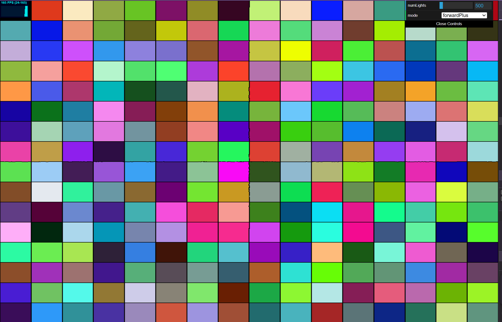
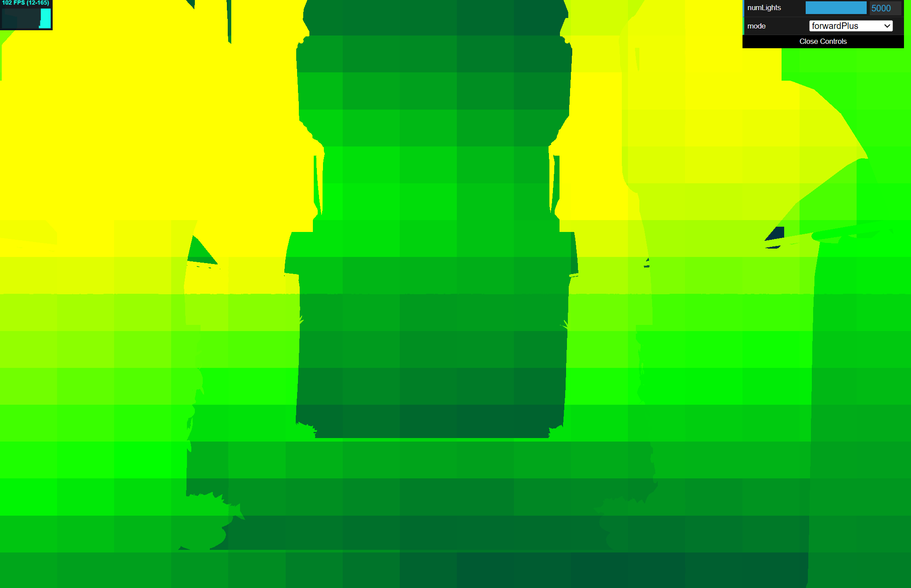
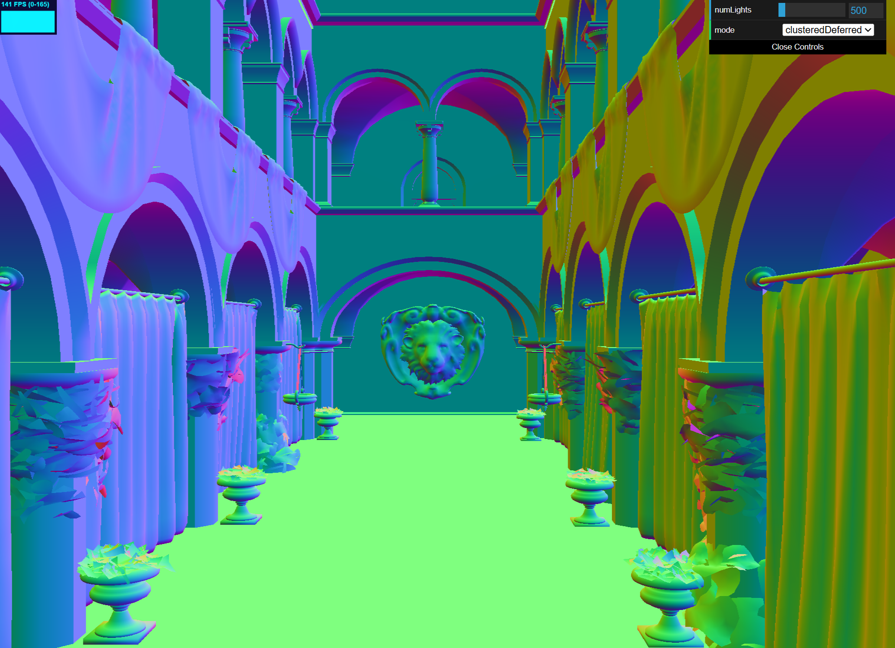
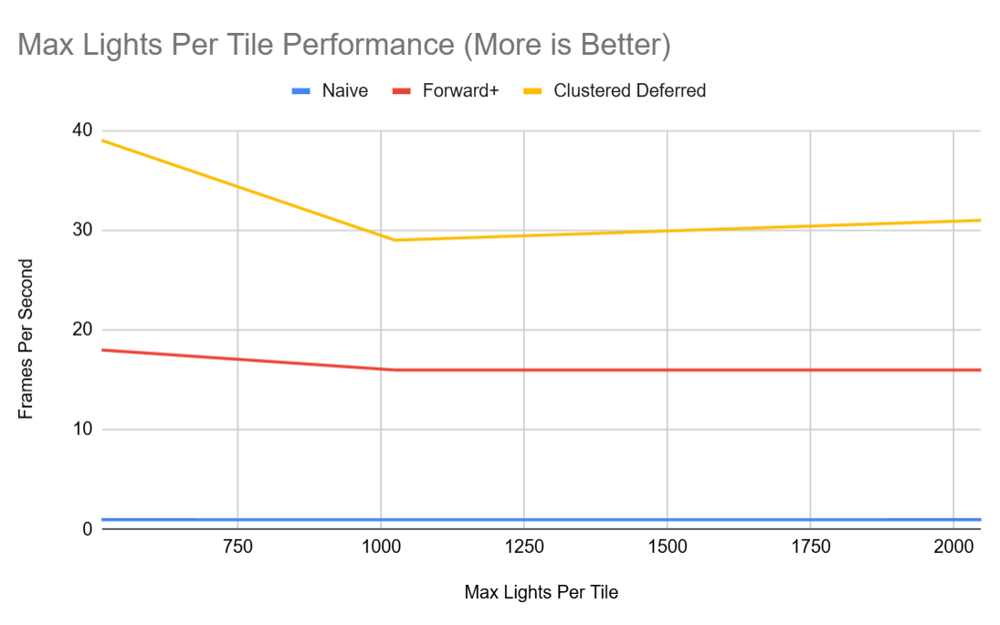
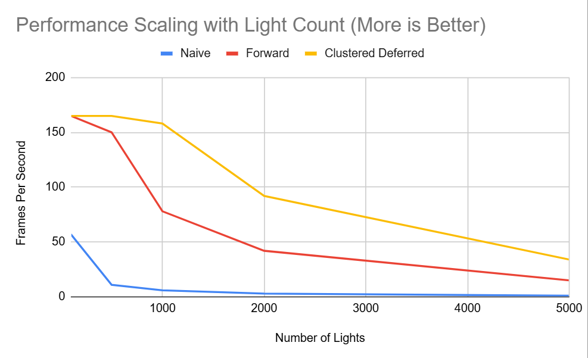

WebGL Forward+ and Clustered Deferred Shading
======================

**University of Pennsylvania, CIS 565: GPU Programming and Architecture, Project 4**

* Harris Kokkinakos
* Tested on: **Google Chrome 141.0.7390.108** on
  Windows 24H2, i9-12900H @ 2.50GHz 16GB, RTX 3070TI Mobile

### Live Demo
Click the link below for an interactive demo!
[[http://TODO.github.io/Project4-WebGPU-Forward-Plus-and-Clustered-Deferred](https://harriskoko.github.io/Project4-WebGPU-Forward-Plus-and-Clustered-Deferred/](https://harriskoko.github.io/Project4-WebGPU-Forward-Plus-and-Clustered-Deferred/)](https://harriskoko.github.io/Project4-WebGPU-Forward-Plus-and-Clustered-Deferred/)

### Demo Video

https://github.com/user-attachments/assets/c1e57756-2535-4b24-b5bf-dba3b6e8c974

### Introduction

This project implements Forward+ and Clustered Deferred shading in WebGPU using TypeScript and WGSL.  
The goal is to explore modern GPU lighting techniques that scale efficiently with large light counts while remaining Web-friendly. This follows the trend of recent large game titles which require the calculation of lighitng in scenes with large amount of lights.

This README will cover the methods implemented and the performance of each method compared to each other. 

### Clustered Forward+ Rendering

Forward+ builds on traditional forward rendering but makes it much more efficient when lots of lights are in the scene. Instead of checking every single light for every pixel, the screen is split into a grid of small tiles. Instead of checking every light for each pixel, we now only check based on which lights and pixels are in which tiles. In my implementation, I divide the screen 16x9 tiles shown below:

Using a compute shader, the renderer figures out which lights actually affect each cluster by checking if a light’s sphere of influence overlaps that cluster’s bounding box. Because the frustum is also sliced in depth, lights are only assigned to clusters within their actual range. For example, a nearby light won’t waste time being processed by fragments far across the scene. The density of lights per tile can be represented in a heatmap which my renderer can show. In this heatmap, the color of each tile is blue when theres a low amount and is interpolated up to red if its at the max number of lights per tile.

### Clustered Deferred Rendering

Clustered Deferred Shading extends the Forward+ approach by performing lighting in a deferred fullscreen pass rather than during geometry rendering. The screen is divided into a 3D grid of clusters using a 16×9 screen-space tiling combined with logarithmic Z-slicing through the camera’s view frustum. These depth slices provide finer resolution near the camera, where geometry and lights are denser, and coarser slices farther away.

In the first stage, called the G-buffer pass, the renderer outputs several textures that store geometric and material information for each visible pixel. The albedo, position (depth), and normals are saved as textures shown below:

During the second stage, the fullscreen lighting pass, a quad covers the entire screen and performs lighting using the data stored in the G-buffer. For each pixel, the fragment shader determines which cluster the fragment belongs to based on its screen coordinates and view-space depth, retrieves the list of lights affecting that cluster, and accumulates their contributions using the G-buffer position and normal.

Because of the added Z-slicing, each pixel only considers lights that intersect its actual depth range rather than all lights visible in its 2D screen tile. This greatly improves culling precision and keeps performance consistent even with thousands of lights distributed throughout the scene.

Clustered Deferred Shading effectively decouples lighting cost from scene complexity, allowing large numbers of dynamic lights while maintaining physically consistent results and stable frame rates.

## Performance Analysis

Before we compare the implementations, we should deteremine what parameters they perform best with. The primary factor into performance for this project is the max number of lights per tile. Shown below is a graph which compares how the max number of lights per tile affect performance

Each method was tested on a scene with 5000 lights to adequately stress test the number of maxx lights per tile. Naive does not use light tiling so it has no affect on it. We see that both clustered forward+ and clustered deferred perform best with lower max lights per tile. However, at 512 lights per tile, there are noticable visual bugs. This is because not all lights are being accounted for as reaching the max begins to cut off lights from contributing to the scenes color. 

Thus, this becomes more of a quality test rather than performance. For testing purposes, 2058 will be the max number of lights per tile as this minimizes the risk of lights not being included while not killing performance. 

Now we are able to compare each of the implementations. Below is a graph showing the frame rate of each implementation with increasing number of lights. 

We can see that clustered deferred performs best in all cases. This makes sense as it is the most optimized method of the three for rendering. It capitalizes on the optimizations of forward plus and deferred, making it the best performer of the three. The most important takeaway from these graphs is that as light count increases, clustered forward+ and clustered deferred, the execution time does not increase drastically. Compared to naive, the execution time of the two clustered implementation increases at a rate far less. This proves that these implementations are accurate in their optimizations for handling increased light counts. Additionally, it makes sense that Clustered Deferred outperforms Clustered Forward+. In Forward+, most of the lighting calculations are performed directly in the fragment shader while rendering geometry. The deferred approach, on the other hand, splits this work into two passes: geometry information is first written to the G-buffer, and lighting is computed later in a fullscreen pass. This trades additional memory usage for reduced per-fragment computation, resulting in better performance when handling large numbers of lights.

### Credits

- UPenn GPU Programming and Architecture Forward and Deferred Shading Slides (by Patrick Cozzi and Mohammed Sheznan)
- Upenn CIS4600 an CIS4610 Slides (by Adam Mally)
- [Vite](https://vitejs.dev/)
- [loaders.gl](https://loaders.gl/)
- [dat.GUI](https://github.com/dataarts/dat.gui)
- [stats.js](https://github.com/mrdoob/stats.js)
- [wgpu-matrix](https://github.com/greggman/wgpu-matrix)
